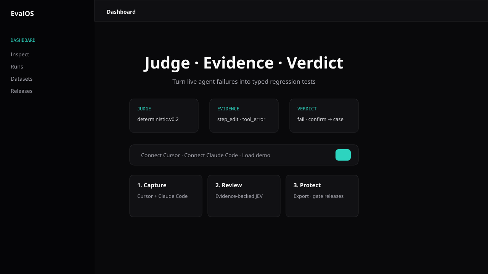

# EvalOS

**Type-safe eval infrastructure for Claude Code and agentic software.**

[](LICENSE)




EvalOS turns live agent sessions into traceable **JEV** records: **Judge, Evidence, Verdict**. It sits beside your agent or coding harness, ingests traces, links findings back to evidence, and helps you promote real failures into regression evals.

The first wedge is simple: connect Claude Code, capture sessions, review failures, and build a typed regression dataset without changing how you use Claude Code.

**Search tags:** `#ClaudeCode` `#AgentEvals` `#AIAgents` `#OpenTelemetry` `#JEV` `#Observability` `#RegressionTesting` `#LLMOps`

## What You Get

- Capture Claude Code sessions as eval-ready traces
- Convert agent failures into typed JEV records
- Link every verdict to trace evidence
- Review failures before they become regression tests
- Export regression cases to JSONL, Promptfoo, or pytest
- Keep your existing agent and harness

## Why EvalOS

AI agents are becoming part of the engineering workflow, but their failures are hard to preserve. A normal test suite can tell you whether code passes. It usually cannot tell you whether an agent:

- used the wrong tool,
- looped on the same action,
- made an unsupported claim,
- ignored trace evidence,
- regressed on a task it previously fixed.

EvalOS gives those failures a durable shape.

```ts
type JevEvaluation = {
  schema: "jev.eval.v1";
  judge: JevJudge;
  evidence: JevEvidence[];
  verdict: JevVerdict;
};
```

## Status

EvalOS is an early open-source MVP. It is local-first and designed for live agent connection. There is no bundled demo data in the dashboard.

Implemented:

- Clean live-data dashboard
- Type-safe JEV model
- JSON run ingestion
- OpenTelemetry-style trace ingestion
- Claude Code hook adapter
- Evidence-backed deterministic evaluator
- Human review queue
- Regression case export: JSONL, Promptfoo, pytest
- Harness-agnostic release results API
- Local in-memory run store

Next:

- Persistent database
- Real Langfuse/Phoenix/Opik connectors
- LLM judge plugins
- GitHub Action release gate
- Dataset versioning UI

## Quick Start

```bash
npm install
npm run dev
```

Open:

```text
http://localhost:3001
```

If Next chooses another port, use the URL printed by `npm run dev`.

## Star-worthy Demo Flow

```text
Claude Code session
        |
        v
EvalOS hook captures transcript
        |
        v
JEV record: judge + evidence + verdict
        |
        v
Human confirms failure
        |
        v
Regression case exported for future runs
```

## Claude Code Integration

EvalOS can use Claude Code as the live agent source.

1. Start EvalOS:

```bash
npm run dev
```

2. Review the hook template:

```bash
Get-Content .claude\evalos.settings.example.json
```

3. Enable it for this repo:

```bash
Copy-Item .claude\evalos.settings.example.json .claude\settings.json
```

4. Run Claude Code normally in the repo.

When a Claude Code task stops, the hook posts a normalized run to:

```http
POST http://localhost:3001/api/runs
```

The dashboard polls `/api/runs`, so new sessions appear automatically.

Claude Code hooks run local commands with your user permissions. Review `.claude/settings.json` before enabling it and avoid sending secrets in transcripts.

## Ingest Traces

Post a neutral run:

```bash
curl -X POST http://localhost:3001/api/runs ^
  -H "content-type: application/json" ^
  -d @trace.json
```

Or use the CLI adapter:

```bash
npx evalos ingest trace.json http://localhost:3001
```

EvalOS accepts plain JSON runs or OTLP-style JSON with `resourceSpans`. OpenTelemetry spans are grouped by `traceId`; each span becomes traceable evidence with `traceId`, `spanId`, `parentSpanId`, attributes, status, timing, and cost where present.

## Harness Results API

EvalOS does not need to run your agent. Your harness runs cases against agent versions, then posts results:

```http
POST /api/results
```

```json
{
  "baselineVersion": "v1",
  "candidateVersion": "v2",
  "results": [
    {
      "caseId": "case_checkout_refund",
      "agentVersion": "v2",
      "passed": true,
      "qualityScore": 86,
      "costUsd": 0.03,
      "latencyMs": 4200
    }
  ]
}
```

Response:

```json
{
  "ciStatus": "pass"
}
```

## Architecture

```text
Claude Code / agents / observability traces
                  |
          JSON or OpenTelemetry
                  |
          Canonical run schema
                  |
              JEV model
      Judge -> Evidence -> Verdict
                  |
       Review queue + analytics
                  |
       Regression case exports
                  |
 External harness -> results API -> CI status
```

## JSON Run Shape

```json
{
  "id": "run_100",
  "source": "json",
  "agentName": "claude-code",
  "framework": "claude-code",
  "environment": "development",
  "startedAt": "2026-09-22T05:00:00.000Z",
  "input": [{ "role": "user", "content": "Fix the failing test" }],
  "steps": [
    {
      "id": "step_1",
      "type": "tool_call",
      "name": "edit_file",
      "durationMs": 300
    }
  ],
  "finalOutput": "Updated the test and implementation."
}
```

## Local APIs

```http
GET /api/runs
POST /api/runs
DELETE /api/runs
POST /api/results
```

`DELETE /api/runs` clears the local in-memory run store.

## Development

```bash
npm run typecheck
npm run lint
npm run build
```

## License

Apache-2.0
